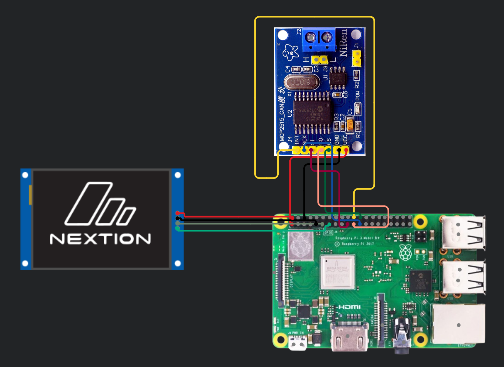
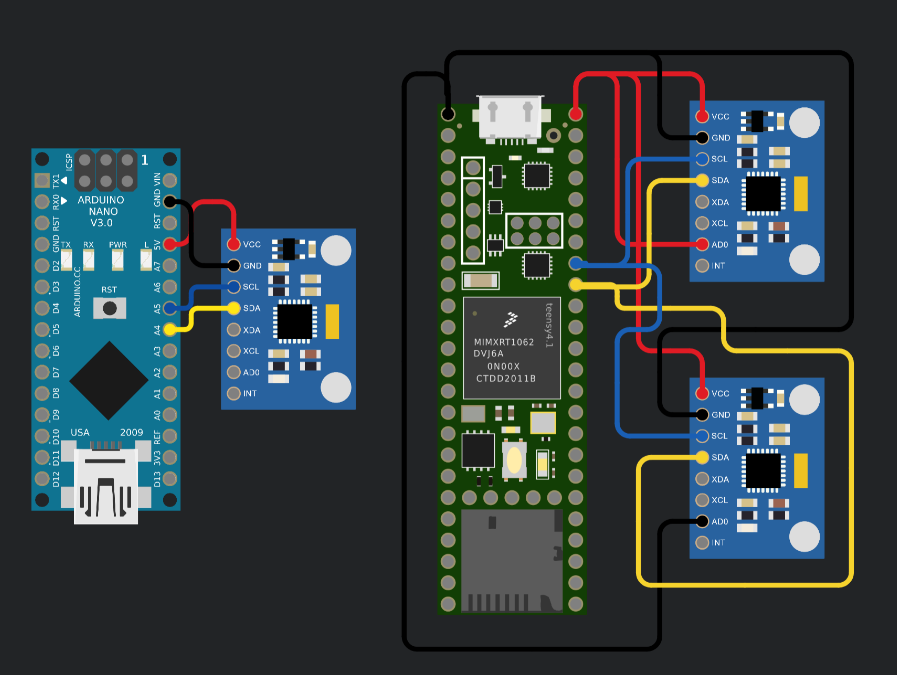

# CRTeam - Sistema de Telemetría 2024-25

Sistema modular para telemetría en vehículos, que integra sensores de aceleración y comunicación CAN. Utiliza Raspberry Pi, Arduino Nano y Teensy para la adquisición y transmisión de datos, mostrando la información en una pantalla Nextion LCD. El sistema permite monitoreo en tiempo real y es fácilmente adaptable a diferentes configuraciones de hardware.

1. [Cableado principal](#cableado-principal)
   1. [Raspberry Pi + MCP2515 + Nextion LCD](#raspberry-pi--mcp2515--nextion-lcd)
   2. [Arduino Nano + Teensy 4.1 + MPU6050](#arduino-nano--teensy-41--mpu6050)
2. [Versiones de acelerómetro \& emisor](#versiones-de-acelerómetro--emisor)
3. [Códigos y librerías](#códigos-y-librerías)

## Cableado principal

### Raspberry Pi + MCP2515 + Nextion LCD

Conecta la Raspberry Pi 3B+ al controlador CAN MCP2515 y a la pantalla Nextion LCD 2.4". La Pi gestiona la comunicación CAN y la pantalla.

**Componentes:**

- Raspberry Pi 3B+
- MCP2515
- Nextion LCD 2.4"

**Conexiones:**

| Pi GPIO | MCP2515/Nextion | Componente |
| ------- | --------------- | ---------- |
| 3.3V    | VCC             | MCP2515    |
| 5V      | VCC             | Nextion    |
| GND     | GND             | Ambos      |
| 11      | SCK             | MCP2515    |
| 10      | SI              | MCP2515    |
| 9       | SO              | MCP2515    |
| 8       | CS              | MCP2515    |
| 25      | INT             | MCP2515    |
| 17      | TX              | Nextion    |
| 27      | RX              | Nextion    |

---

### Arduino Nano + Teensy 4.1 + MPU6050

Lee datos de tres sensores MPU6050 (acelerómetro + giroscopio). El Nano gestiona uno y el Teensy dos, usando I2C compartido.

**Componentes:**

- Arduino Nano
- Teensy 3.5/4.1
- MPU6050

**Conexiones:**

**Nano → MPU6050:**

| Nano | MPU6050 |
| ---- | ------- |
| 5V   | VCC     |
| GND  | GND     |
| A5   | SCL     |
| A4   | SDA     |

**Teensy → MPU6050:**

| Teensy   | MPU6050 (1) | MPU6050 (2) |
| -------- | ----------- | ----------- |
| 64 (5V)  | VCC & AD0   | VCC         |
| 12 (GND) | GND         | GND & AD0   |
| 57       | SCL         | SCL         |
| 56       | SDA         | SDA         |

---

## Versiones de acelerómetro & emisor

Hay dos versiones del código:

- **v0**: funciona correctamente, la integración y el envío de datos son estables.
- **v1**: presenta problemas con la corrección de gravedad, por lo que se recomienda usar la versión 0.

---

## Códigos y librerías

**Arduino (emisor/receptor):**

- ArduinoJson
- mrf24_lib

**Teensy (acelerómetro):**

- ACAN
- Madgwick
- MPU6050
